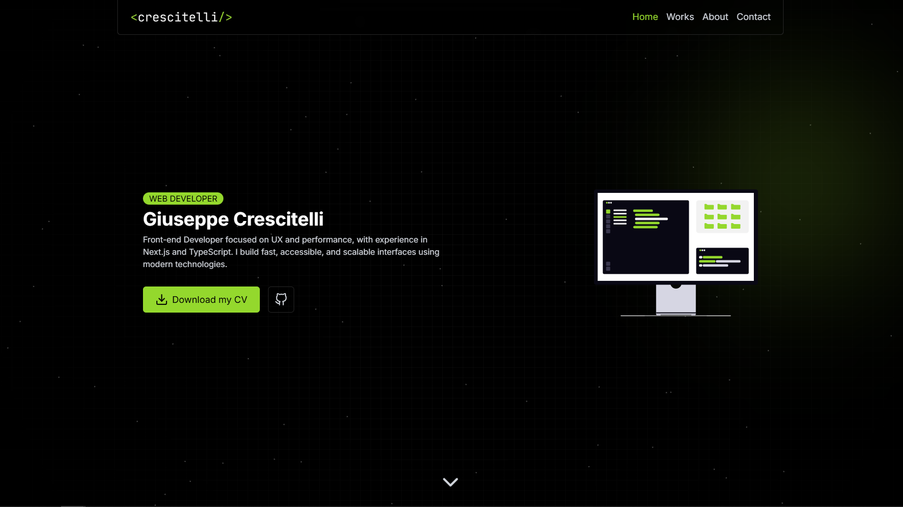
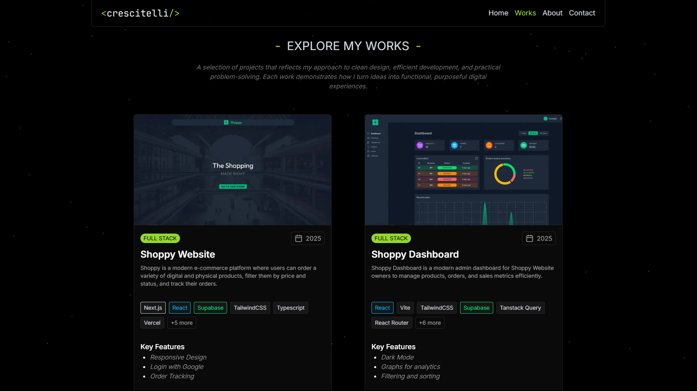
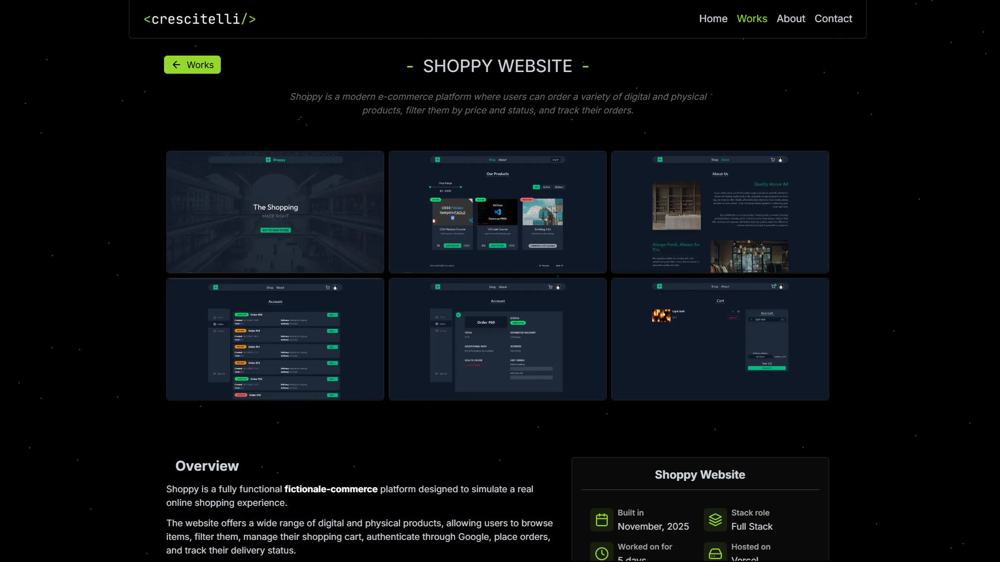
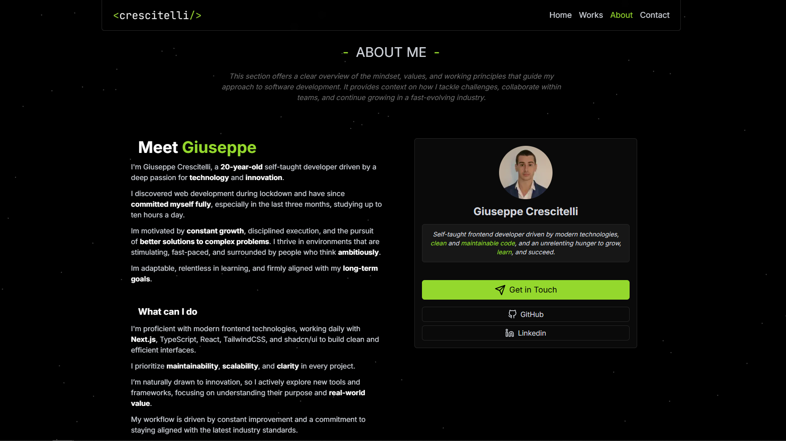
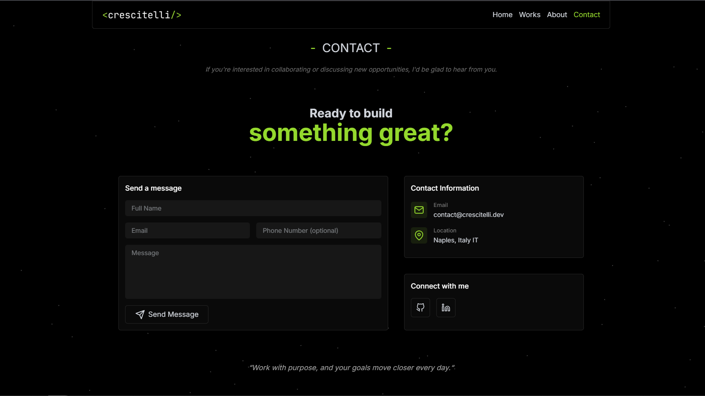
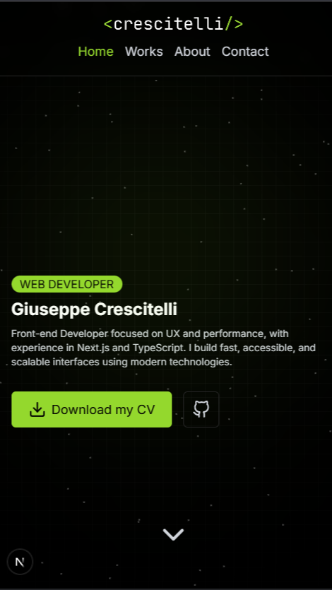

# Portfolio

This is my personal portfolio built with Next.js, TypeScript, and MDX. It showcases my projects, skills, and experience as a frontend developer. The site features a clean, responsive design, interactive components, and a focus on performance and accessibility. It serves as a hands-on demonstration of my abilities in modern web development.

## Images




### Works Page




### About Page



### Contact Page



### Responsive Design



## Tech Stack

- React 19.2
- Next.js 16.0.5
- TailwindCSS 4.1
- TypeScript
- React Feather
- react-hot-toast
- react-hook-form
- MDX
- React Email
- Resend
- TsParticles
- Frame Motion

## Installation

1. Clone the repository:

```bash
git clone https://github.com/crstelli/portfolio
```

2. Navigate into project folder

```bash
cd portfolio
```

3. Install dependencies

```bash
npm install
```

4. Start the development server:

```bash
npm run dev
```

5. Open your browser and navigate to:

```bash
http://localhost:3000
```

## Environment Variables

You need to configure environment variables for the app to work correctly.
Create a `.env` file in the project root and add:

```bash
RESEND_API_KEY=Your Resend API Key
```

## Features

- Responsive Design
- Animation with Framer Motion
- Particles Background with TsParticles
- Complete Tech Stack Descrition
- Contact Form
- Specific Work page for each project
- Complete About Page with all information

## Future Improvements

- Specific pages for each technology I use
- Testimonials section
- Blog

## Author

Giuseppe - [LinkedIn](https://linkedin.com/in/giuseppecrescitelli) - [Portfolio](https://crescitelli.dev)

## License

This project is licensed under the [MIT License](LICENSE).
